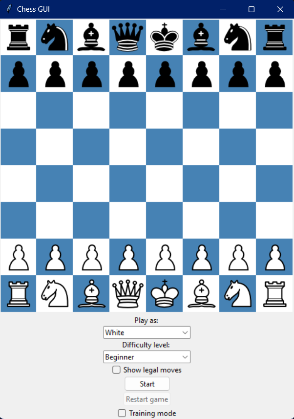

# Chess GUI
This Python script runs a GUI that simulates the popular game of chess. The user plays against a computer that is powered by [Stockfish](https://stockfishchess.org/). The user has the option to choose which color to play as, the computer difficulty, whether to show legal moves, and whether to enable training mode.

## Getting started
To start, clone this repository to a local directory by typing `git clone https://github.com/pragyatk/Chess-GUI.git` in your terminal. Then, navigate to the `Chess-GUI` directory and type `python play_chess.py` in the terminal to execute the script and have the GUI pop up.

## GUI structure

Once the GUI pops up, the user will have several options to choose before and even during the game. The user must select a color to play as before starting the game by clicking the `Start` button. The user may change the CPU difficulty, whether to show legal moves, and whether to enable training mode at any time during the game.

## Training mode
Training mode is an option that assists the user with responding to computer moves. When enabled, the user can attempt to play a move. If the move is not deemed the best in the position according to Stockfish, a red square will flash around the piece to move as a hint to the user. If the user makes another wrong move, a red arrow will flash indicating where to move the piece.